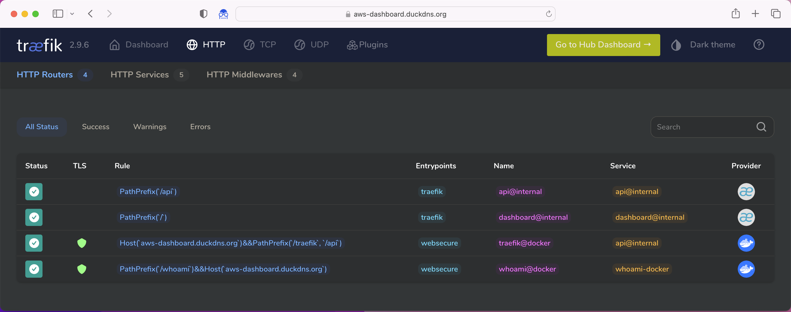

# Terraform AWS Free Tier

> Getting started with the Terraform for managing a base free-tier AWS resources.

### Project description

This is a [Terraform](https://www.terraform.io/) project for managing AWS resources. 

It can build the next infrastructure:

   * [VPC](https://docs.aws.amazon.com/vpc/latest/userguide/what-is-amazon-vpc.html)
   * Public [Subnet](https://docs.aws.amazon.com/vpc/latest/userguide/working-with-vpcs.html#AddaSubnet) in the `VPC`
   * [IGW](https://docs.aws.amazon.com/vpc/latest/userguide/VPC_Internet_Gateway.html) to enable access to or from the Internet for `VPC`
   * [Route Table](https://docs.aws.amazon.com/vpc/latest/userguide/VPC_Route_Tables.html) to associate `IGW`, `VPC` and `Subnet`
   * [RDS Instance](https://docs.aws.amazon.com/AmazonRDS/latest/UserGuide/concepts.html) in the private `Subnet`
   * [EC2 Instance](https://docs.aws.amazon.com/AWSEC2/latest/UserGuide/concepts.html) in the public `Subnet` with the HTTPS Lets Encrypt certificate & SSH access with free dynamic DNS provider
      * [Docker](https://docs.docker.com/get-started/overview/) running on EC2: [docker-compose.yaml](./src/docker/docker-compose.yaml)
         * [Free dynamic DNS host on AWS](https://www.duckdns.org/)
         * [Web application sample](https://github.com/traefik/whoami)
            * My personal URL: https://aws-dashboard.duckdns.org/whoami
         * [Traefik](https://traefik.io/traefik/): Reverse proxy, [Lets Encrypt](https://letsencrypt.org/), [Traefik Lets Encrypt](https://doc.traefik.io/traefik/https/acme/)
            * My personal URL: https://aws-dashboard.duckdns.org/traefik
            * 
   * [S3 buckets](https://docs.aws.amazon.com/AmazonS3/latest/userguide/Welcome.html) 
   * [Lambda](https://docs.aws.amazon.com/lambda/latest/dg/gettingstarted-concepts.html)
      * Samples
         * [Python](https://github.com/awsdocs/aws-lambda-developer-guide/tree/main/sample-apps/blank-python) [Source code](./src/free-tier/lambda/samples/python)
         * [Golang](https://github.com/awsdocs/aws-lambda-developer-guide/tree/main/sample-apps/blank-go) [Source code](./src/free-tier/lambda/samples/golang)
         * [Java](https://github.com/awsdocs/aws-lambda-developer-guide/tree/main/sample-apps/blank-java) [Source code](./src/free-tier/lambda/samples/java)
         * [RUST](https://docs.aws.amazon.com/sdk-for-rust/latest/dg/lambda.html), [RUST Runtime for AWS Lambda](https://github.com/awslabs/aws-lambda-rust-runtime): [Source code](./src/free-tier/lambda/samples/rust)

### Pre steps

1. Install software
   * Install infrastructure tools
```shell
brew install terraform awscli yq zip
```

   * Install general development tools
```shell
brew install make
```

   * Install PYTHON
```shell
brew install pyenv
```

   * Install GO
```shell
brew install golang
```

   * Install JAVA
```shell
brew install jenv java11
```

   * Install RUST: https://rustup.rs
```shell
curl --proto '=https' --tlsv1.2 -sSf https://sh.rustup.rs | sh
rustup target add x86_64-unknown-linux-gnu
brew tap cargo-lambda/cargo-lambda
brew install cargo-lambda
```

2. [Create AWS account](https://amazon.com/aws)
3. If the file `~/.aws/credentials` doesn't exist, create it and add you Terraform profile to the file. For example:
```text
   [terraform]
   aws_access_key_id = Your access key
   aws_secret_access_key = Your secret access key 
```
4. Check AWS account
```shell
aws sts get-caller-identity
```
5. Create S3 bucket to store Terraform state
```shell
aws s3api create-bucket --bucket world-terraform --region us-east-1
```
6. Create config file `config.tf` that will contain information how to store state in a given bucket. See [example](./src/free-tier/backend/example.config.tf).

8. Create SSH key pair to connect to EC2 instance:
```shell
   cd ./src/free-tier/provision/access

   # it creates "free-tier-ec2-key" private key and "free-tier-ec2-key.pub" public key
   ssh-keygen -f free-tier-ec2-key
``` 
   
### Build infrastructure

   * Install Python
```shell
pyenv install 3.8.16
cd ./src/free-tier/python
pyenv local 3.8.16
```

   * Install Java
```shell
jenv enable-plugin gradle
```

   * Build lambda samples
```shell
cd ./src/free-tier/lambda/samples
make all
```

```shell
cd ./src/free-tier
terraform init -backend-config="./backend/config.tf"
```

```shell
cd ./src/free-tier
terraform plan
```

```shell
cd ./src/free-tier
terraform apply
```

### Post install

```shell
ssh-add src/free-tier/provision/access/free-tier-ec2-key
ip=$(aws ec2 describe-instances | 
      yq 'select(.Reservations[].Instances[].State.Code == 16) | .Reservations[].Instances[].NetworkInterfaces[].PrivateIpAddresses[].Association.PublicIp')
echo $ip
```

   * Edit /etc/hosts add "aws" host name
```shell
sudo bash -c "echo $ip aws >> /etc/hosts"
```

   * Generate SSH private key
```shell
ssh-keygen -R aws  
ssh-keyscan -H aws >> ~/.ssh/known_hosts
ssh-keygen -R $ip
ssh-keyscan -H $ip >> ~/.ssh/known_hosts
```

   * Install EPEL, Postgres 14 packages
```shell
ssh ec2-user@$ip "sudo amazon-linux-extras install epel postgresql14 -y"
```

   * Upgrade Linux and install packages
```shell
ssh ec2-user@$ip "sudo yum update && sudo yum upgrade -y && sudo yum install -y netcat openvpn postgresql docker python3-pip htop"
```

   * Install Docker compose, configuration
```shell
ssh ec2-user@$ip "sudo usermod -a -G docker ec2-user && sudo pip3 install docker-compose"
ssh ec2-user@$ip "sudo systemctl enable docker.service && sudo systemctl start docker.service && systemctl status docker.service"
```

   * Edit src/docker/env-duckdns.sh
```text
SUBDOMAINS=your-subdomain
DUCKDNS_TOKEN=your-token
TOKEN=$DUCKDNS_TOKEN
``` 

   * Edit src/docker/docker-compose.yaml, set email and Duckdns subdomain TODO

   * Edit src/docker/conf/users.txt TODO

   * Copy Docker files
```shell
ssh ec2-user@$ip "mkdir -p docker/conf"
scp src/docker/docker-compose.yaml src/docker/env-duckdns.sh ec2-user@$ip:./docker/
scp src/docker/conf/dynamic_conf.yml ec2-user@$ip:./docker/conf/dynamic_conf.yml
scp src/docker/conf/users.txt ec2-user@$ip:./docker/conf/users.txt
```

   * Start Docker containers
```shell
ssh ec2-user@$ip "cd docker && docker-compose up -d"
```

# Duckns
   * https://www.duckdns.org/

   * ./src/docker/env-duckdns.sh
```text
TZ=America/Sao_Paulo
SUBDOMAINS=sub-domain-1,sub-domain-2,sub-domain-3,sub-domain-4,sub-domain-5
DUCKDNS_TOKEN=your-token
TOKEN=your-token
```

   * Duckdns logs
```shell
ssh ec2-user@$ip "cd docker && docker-compose logs duckdns"
```

# Traefik
   * Traefik logs
```shell
ssh ec2-user@$ip "cd docker && docker-compose logs traefik"
```

# AWS RDS
```shell
aws rds describe-db-instances | yq
```

   * Get Postgres endpoint
```shell
address=$(aws rds describe-db-instances | yq '.DBInstances[] | select(.DBName=="labdb") | .Endpoint.Address')
port=$(aws rds describe-db-instances | yq '.DBInstances[] | select(.DBName=="labdb") | .Endpoint.Port')
echo $address:$port
```

   * Check Postgres routing from EC2
```shell
ssh ec2-user@$ip "nc -v $address $port"
```

   * Postgres cli
```shell
ssh ec2-user@$ip psql --host $address --port $port --username postgres
```

# Destroy infrastructure
```shell
cd ./src/free-tier
terraform destroy
```

# Links to similar projects
   * https://github.com/pvarentsov/terraform-aws-free-tier
